# Bayleaf: ultra-low-profile wireless split keyboard (reproduction)

This is an open, buildable re-creation of Sebastian Graz's [Bayleaf](https://www.graz.io/articles/bayleaf-wireless-keyboard/): a 60-key (2 × 5×6) ortholinear split keyboard. It uses Kailh PG1316S laptop-style switches, runs ZMK on nice!nano controllers, and sits in a CNC-machined aluminium case 5 mm thick.

> **Provenance.** The original Bayleaf is a one-off prototype and is **not open source**. None of its files are used here. This repository is an independent design built to the published specs (139 × 93 mm per half, 5 mm thick, ~180 g, PG1316S, nice!nano/ZMK, CNC aluminium enclosure, MJF keycaps). Everything else was designed from scratch: board layout, pin mapping, case geometry, keymap and part choices. The PG1316S land pattern comes from Kailh's datasheet (CPG1316S01D02).

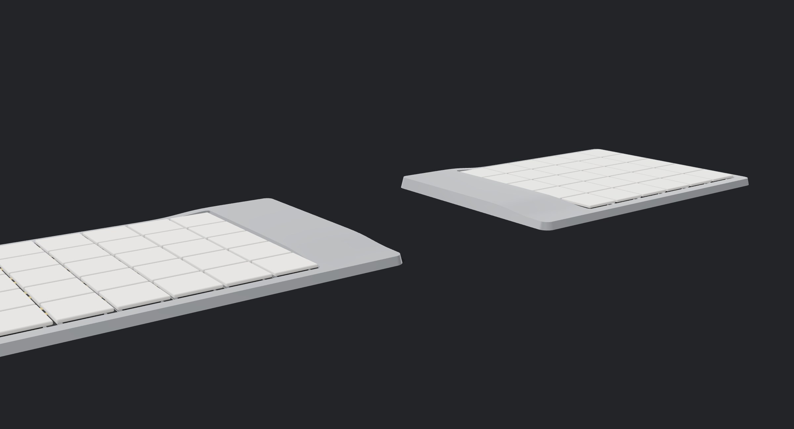

| | |
|---|---|
| 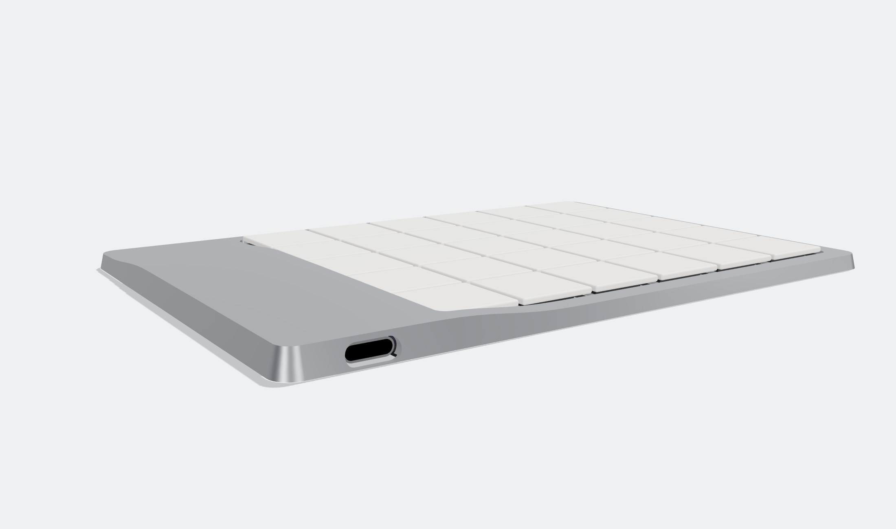 | 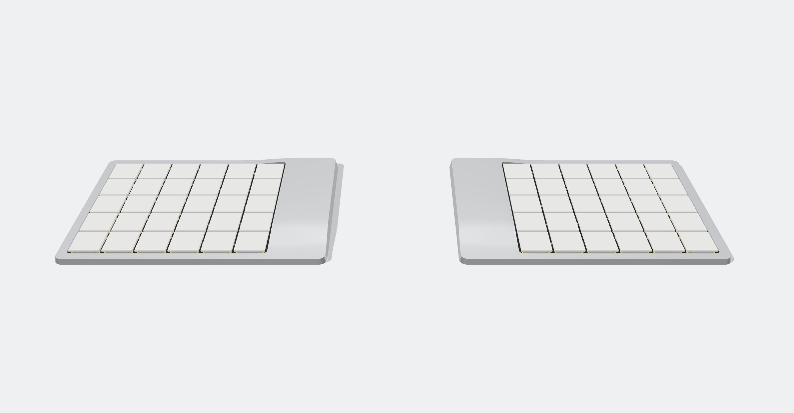 |
| 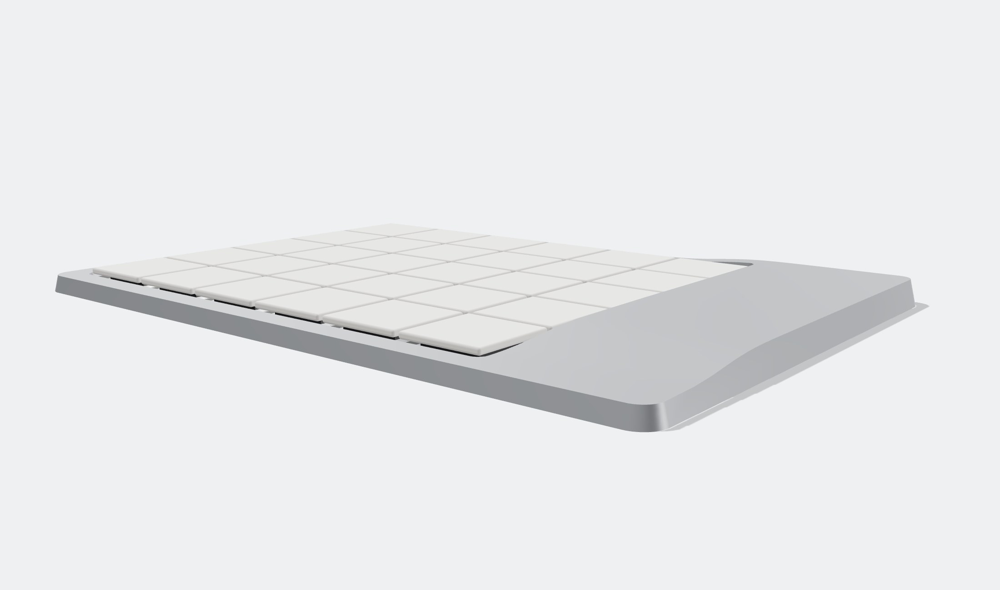 | 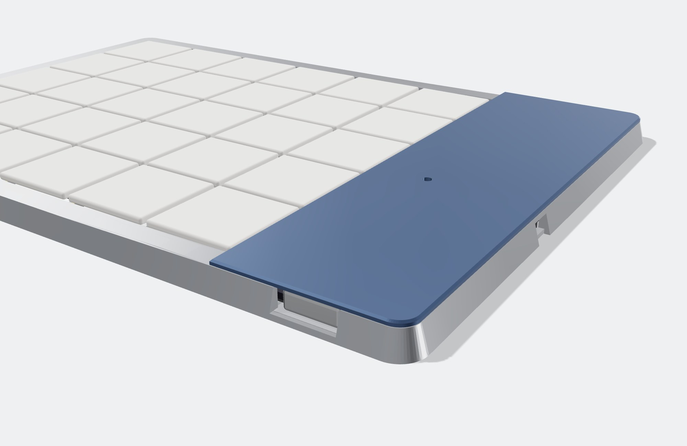 |
| 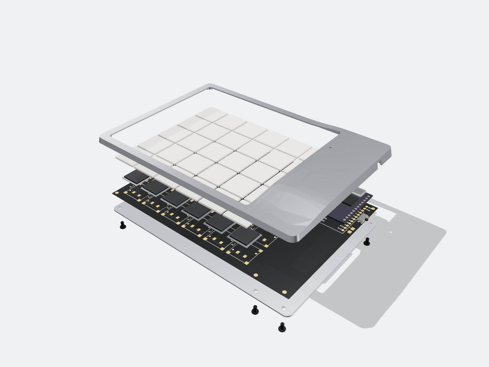 | 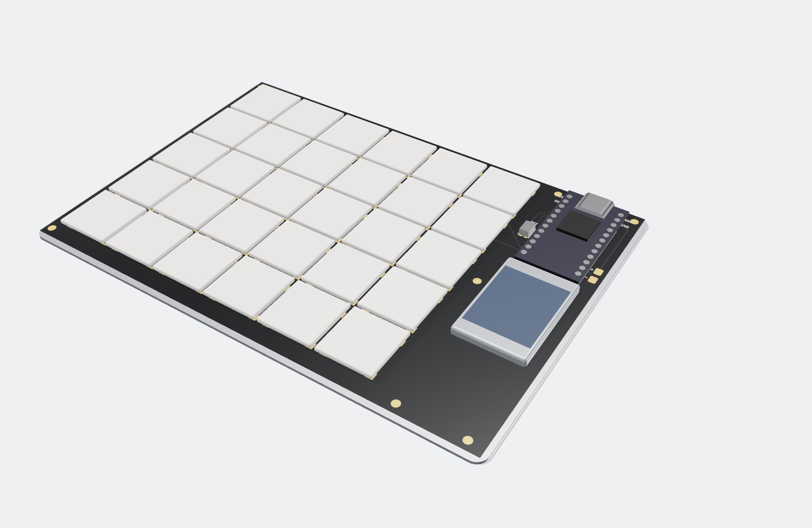 |
| 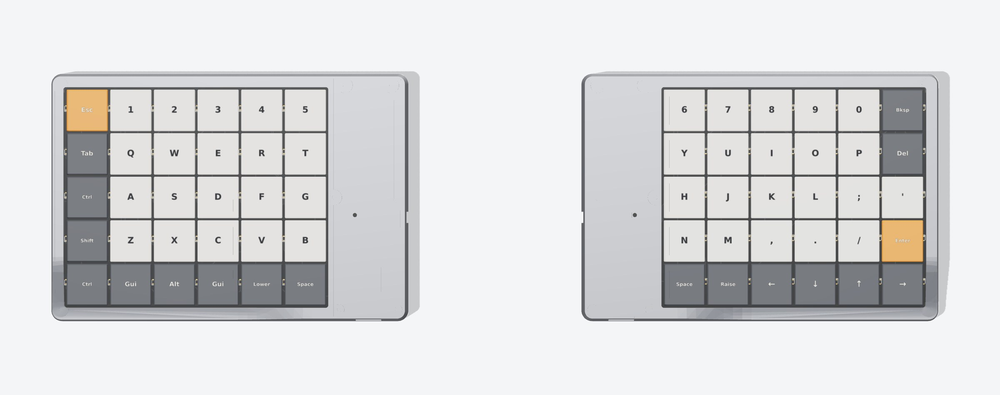 | 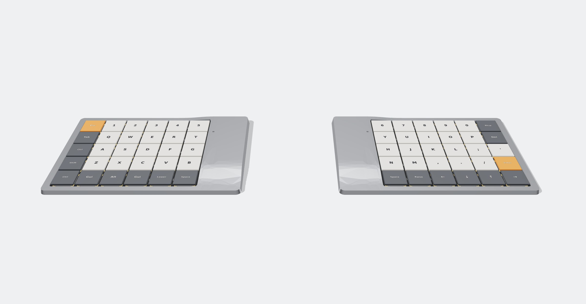 |

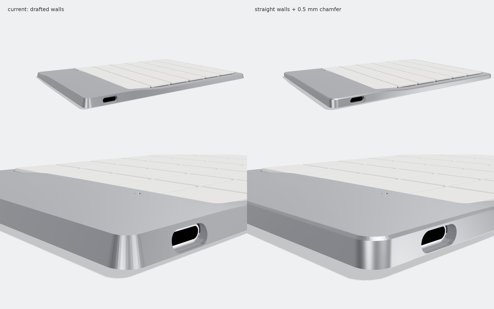

*Renders are generated from the actual STEP files and the routed PCB artwork (`docs/render3d/render.sh`). The case follows the original's MK5 drawing for the plan view and, for the top surface, the shape drawn in the [case sketchpad](https://claude.ai/artifact/11zAxZXfv3bXQXGKN8ovCU) ([data](docs/case-sketchpad-shape.json)): a one-piece silver shell with two flat levels, a 3.2 mm rim around the keys and a 5.0 mm plateau over the controller, joined by soft S-bends, plus a screwed-on bottom plate.*

| | Original Bayleaf (published) | This reproduction |
|---|---|---|
| Layout | 60 % ortholinear split | 2 × 5 rows × 6 columns, 17 × 17 mm pitch |
| Size per half | 139 × 93 mm; "tallest part is only 5 mm" | 139.4 × 96.8 mm base. 3.2 mm rim around the keys; 5.0 mm plateau over the controller |
| Weight | 180 g | ~185 g estimated (shell 15 g + plate 28 g of 6061 per half) |
| Switches | Kailh PG1316S | Kailh PG1316S, reflow-soldered |
| Keycaps | custom MJF prints | stock Kailh PG1316S 1U caps (16 × 16 mm) |
| Controller | nice!nano, ZMK | nice!nano v2 soldered flush, ZMK (BLE split) |
| Battery | "over a month" | 302030 LiPo (~120–150 mAh) per half, deep sleep after 15 min |
| Case | CNC aluminium, raised over the controller | One-piece CNC 6061 shell (key window, roofed controller bay, 7 tapped M2 posts) + 0.8 mm bottom plate ([notes](docs/case-drawing.md)) |

## What's in here

```
hardware/pcb/generate_pcb.py      the whole PCB as code: placement, nets, outline -> Freerouting -> DRC -> fab files
hardware/pcb/bayleaf-{left,right}.kicad_pcb   routed KiCad 7 boards (open in KiCad to inspect or edit)
hardware/pcb/lib/bayleaf.pretty/  footprints: PG1316S, nice!nano (flush), battery pads
hardware/pcb/fab/{left,right}/    gerbers+drill zip, JLCPCB BOM/CPL, 3D STEP of the board, DRC report
hardware/case/case.py             parametric shell (drafted or straight + chamfer) + bottom plate (CadQuery); out/ has STEP + STL
firmware/                         ZMK shield "bayleaf" + keymap; built by .github/workflows/firmware.yml
docs/BOM.csv                      full bill of materials with prices
docs/ordering.md                  exact fab settings (PCB, PCBA, CNC, parts)
docs/assembly.md                  step-by-step build guide
docs/schematic.md                 circuit / pin map
docs/case-drawing.md              case dimensions, tapped holes, screws
```

| Left PCB | Right PCB |
|---|---|
| 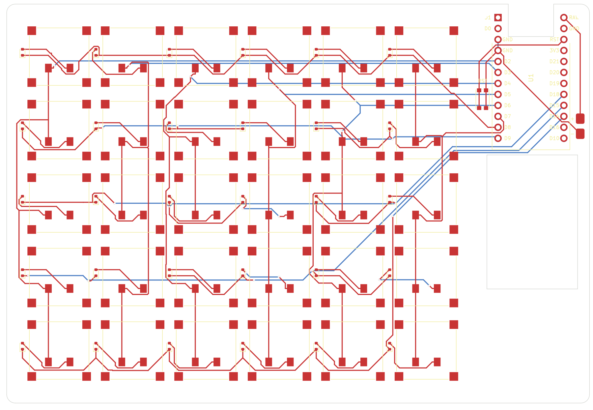 | 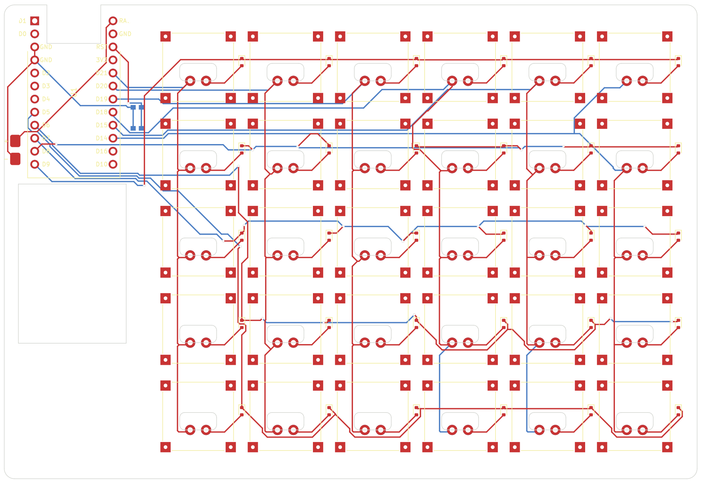 |

## How much does one cost?

These are estimates from September 2026 for a single keyboard, including spares and shipping. The details are in [`docs/BOM.csv`](docs/BOM.csv).

| | USD |
|---|---:|
| PCBs (2 designs × 5 pcs, 0.8 mm, ENIG) | 40 |
| 64 × Kailh PG1316S switches | 64 |
| 60 × PG1316S keycaps | 27 |
| 2 × nice!nano v2 | 50 |
| 2 × LiPo 302030 | 8 |
| Diodes, reset buttons | 2 |
| Foam tape, Kapton, bumpons, M2 screws | 19 |
| Shipping (rough) | 35 |
| 2 × CNC aluminium shell + bottom plate (6061, anodised) | 200 |
| **Electronics only** (PCBs, switches, diodes, controllers, batteries, reset buttons) | **≈ $164** |
| **Total with aluminium case** | **≈ $445** |
| **Total with printed nylon case instead** | **≈ $285** |

Optional extras: JLCPCB assembly of the 62 small SMD parts (≈ $40), SMT stencils (≈ $14), and a hotplate plus low-temp paste if you don't own them (≈ $60–120).

Most of the extra units are leftovers you can't avoid: 3 spare PCBs per side at the 5-piece minimum, spare switches, and so on.

## Build it

1. **Order**: follow [docs/ordering.md](docs/ordering.md). Upload the gerber zips, optionally the JLC BOM/CPL, and the case STEP files. Buy switches, caps, 2 nice!nanos and 2 cells.
2. **Firmware**: GitHub Actions builds `bayleaf_left`, `bayleaf_right` and `settings_reset` UF2s on every push. See [firmware/README.md](firmware/README.md).
3. **Assemble**: follow [docs/assembly.md](docs/assembly.md). The rough order is diodes → switches (hotplate) → reset button → nice!nano flush → battery → PCB into the shell → bottom plate + 7 screws.

## Regenerating the design

The committed outputs are all you need to order. To change something (pitch, board size, pin map, case wall), edit the constants at the top of `generate_pcb.py` or `case.py` and run:

```sh
make pcb      # KiCad 7 python (pcbnew) + Freerouting 2.x jar (FREEROUTING_JAR=...)
make case     # CadQuery (shell + bottom plate)
make render   # README renders (docs/render3d)
```

The PCB script autoroutes with Freerouting and re-runs until nothing is unrouted. It writes a DRC report next to the gerbers. The committed boards have **0 unconnected pads and 0 electrical DRC errors**; the report only lists cosmetic silkscreen and library-path warnings. Freerouting isn't deterministic, so each regeneration produces different (equally valid) traces.

## Status and caveats

* **Not yet built.** The design passes DRC and the case was checked against the board in CAD, but no physical prototype exists yet. Order one set of PCBs before ordering in quantity.
* The PG1316S footprint follows the Kailh datasheet land pattern. Its contact-pad coordinates were cross-checked against the dimensions Mike Holscher published for his working [mikefive](https://github.com/mikeholscher/zmk-config-mikefive) build. Still, print the board 1:1 and check a real switch against it before ordering.
* The nice!nano is soldered flush, without sockets, to reach 5 mm. Flash and test it **before** soldering it down.
* The LCSC part numbers in the BOM are well-known parts, but check stock before ordering.
* **Case vs. the original.** The plan view comes from the MK5 drawing and the top surface from the sketchpad shape (3.2 / 5.0 mm levels, a square-cornered plateau at x ≥ 96.5, y ≤ 76 mm, 16.5 mm S-bends). The overall depth (4.2 mm border all round) and the keycap height (~4.4 mm) are my estimates. [docs/case-drawing.md](docs/case-drawing.md) marks which numbers come from where.
  * The plateau only covers the back 76 mm of the controller strip, so the PCB is laid out for it: the nice!nano's USB-C faces the **back** wall, the reset button (KMR2) sits beside it, and the cell is a **302030** in front of it (a 302040 would run into the bend).
  * The two posts beside the USB port are moved outward, so they don't land on the nice!nano's pins.
  * Threads are 2 mm deep under the plateau and 1.1 mm under the rim (M2×2 screws there); the drawing's 3 mm ones don't fit under 5 mm.
  * **No power switch.** The cell is wired straight to the nice!nano; ZMK's deep sleep (after 15 min idle, a key press wakes it) keeps the drain to a few µA. To store it for months, unsolder a battery lead.
  * The USB-C opening is a stadium around the receptacle (9.7 × 3.9 mm). The receptacle sits 1.5–2 mm behind the outer wall, so the cable's plug overmold has to fit that opening: slim-overmold cables and magnetic-tip adapters work, bulky plugs won't seat.
  * **Two wall styles** are generated: the default has the drafted walls of the MK5 drawing; `bayleaf-shell-*-chamfer` has straight walls with a 0.5 mm × 45° chamfer along the top edge ([comparison](docs/img/3d/compare.jpg)). Both use the same bottom plate and PCB.
* **Radio.** The nice!nano sits under the aluminium roof. BLE range may suffer, which is a known trade-off of full-metal cases. The firmware already uses +8 dBm TX power, and a printed shell avoids the problem.
